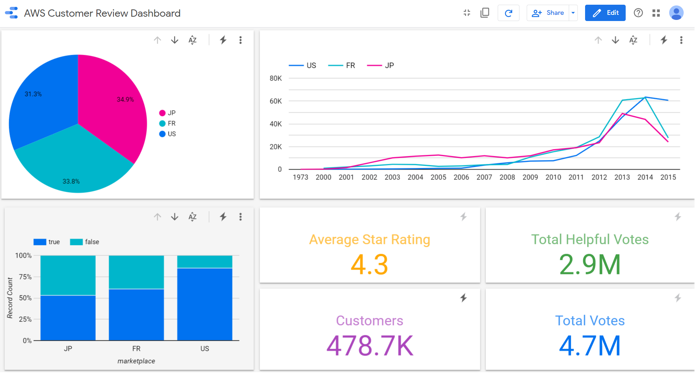

### Aim: 
Amazon Customer Reviews Analytics

### Description:
This project aimed to develope a data analytics dashboards for Amazon Customer Review Dataset. This is an extension to the project GCP Data Analytics Piepline. It considers the data is avaiable on GCP big-query for instance and then can be queried and visualize using GCP big-query and data studio. We can connect big query database to other analytical tools such as Tableau, Power BI, Microstrategy, Excel, Looker and so on.

### Tags: 
analytics-pipeline, pub-sub, big-query, data-flow, tableau-dashboards

### Dataset: 
Avaialable on https://registry.opendata.aws/amazon-reviews/

### Python Implementation:
AWS Customer Review Analysis.ipynb

## Data Analytics:

## Uploading Data from Local Machine to GCP Big Query:
**Follow the AWS Customer Review Analysis.ipynb file to setup and upload data to GCP big query database**

**Once Data is uploaded to big-query, we can query our data to perform some quick analytics**

## Quering GCP Big-Query:

**1. Login to GCP Console https://console.cloud.google.com and Navigate to Big Query service**

**2. Select the Project ID and Dataset for the Amazon Customer Reviews**

**3. Explore the Reviews table and related schema which is auto detected while uploading data**

### 4. Query your data for first 50 records just the quick look of the data

**NOTE: Before execution of the query GCP will let you know what size of data it will process for the qiven query and it will bill against that. Also, GCP will cache that data for the future related queries to avoid long execution and related billing **

### 5. Once a query is executed, GCP will show you the result and statistics

### 6. Let's try to re-execute the same query to see if execution time

**NOTE: You can see that there is no execution time for displaying the result as it was read from caches. You can disable the cache by clicking More --> Query Settings --> Cache Preference --> Uncheck the box Use cached results**

### 7. Query for Average star rating, Total votes and helpful votes by product category

**NOTE: You can see the JSON result on the console**

**NOTE: To see the Job Information on the console**

### 8. Query top 5 product for each category with average star rating is greater than 4.5 and number of review is graeter than 10

**NOTE: You can see the JSON result on the console**

### 9. Query top 10 customers to review products and related average star rating

**NOTE: You can see the JSON result on the console**

## Analytics:

** Let's perform some analytics on Amazon Customer Reviews with GCP Data Studio

[Interactive Dashboard Avaiable here] (https://datastudio.google.com/embed/reporting/ac4f50d1-f071-4045-a23b-feafa9a80553/page/U6VAB)

