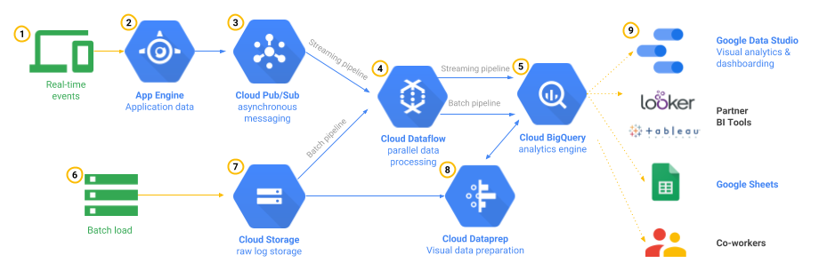

**Aim:** GCP Data Analytics Pipeline

**Description:** This project is aim to develope GCP Data analytics pipeline that will cover batch-processing and real-time data streaming for Amazon Customer Review Dataset. Once Data is caputred, it will be analyse through any analytical tool such as GCP Data Explorer, Tableau, MS Power BI and so on.

**Tags:** **analytics-pipeline**, **pub-sub**, **big-query**, **data-flow**, **tableau-dashboards**

**Dataset:** Avaialable on https://registry.opendata.aws/amazon-reviews/

**Python Implementation:** Big Data Analytics Piepline.ipynb

**Data Analytics:** We will analyse the Amazone Customer Review dataset in other project
